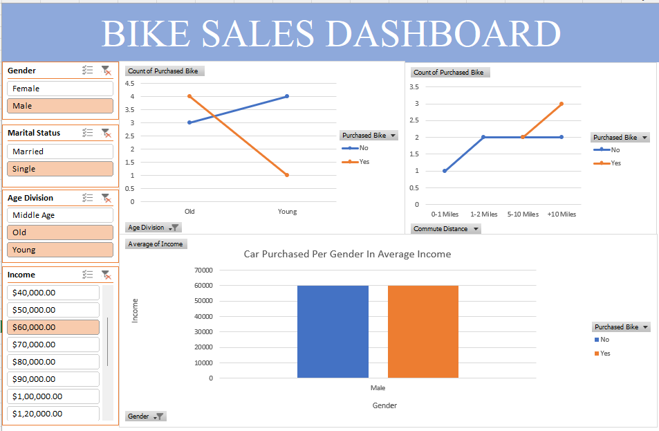

# Bike Buyers Sales Analysis & Interactive Excel Dashboard

## 📌 Project Overview
This project analyzes a customer dataset containing demographics, income, commute distance, and purchasing behavior to uncover key drivers behind bike purchases. The goal was to clean raw survey data, build aggregated pivot tables, and assemble an interactive dashboard to support business decision-making.

## 🛠️ Tools & Excel Techniques Used
- **Microsoft Excel**
- **Data Cleaning:** Removed duplicates, standardized text fields (`M`/`S` to Married/Single, `M`/`F` to Male/Female), and constructed custom categorical age buckets (`Adolescent`, `Middle-Aged`, `Old`).
- **Data Analysis:** Pivot Tables, Aggregations (`AVERAGE`, `COUNT`), Custom Calculated Fields.
- **Data Visualization:** Pivot Charts, Dashboard layout design (gridlines disabled), Interactive Slicers with multi-chart report connections.

## 📊 Interactive Dashboard Preview

## 💡 Key Business Insights
1. **Income Impact:** Customers who purchased a bike had a higher average income across both male and female demographics compared to non-buyers.
2. **Commute Distance:** The highest concentration of bike purchases occurred among customers with short commute distances (0–1 miles), whereas long-distance commuters (>10 miles) had significantly lower conversion rates.
3. **Age Demographic:** The middle-aged demographic (31–54 years old) represented the largest customer segment for bike purchases.

## 🚀 How to View
Download the `Bike_Sales_Dashboard.xlsx` file to interact with the dynamic slicers directly in Microsoft Excel.
